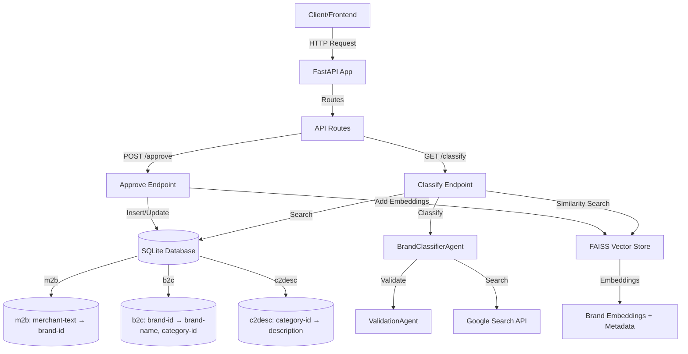
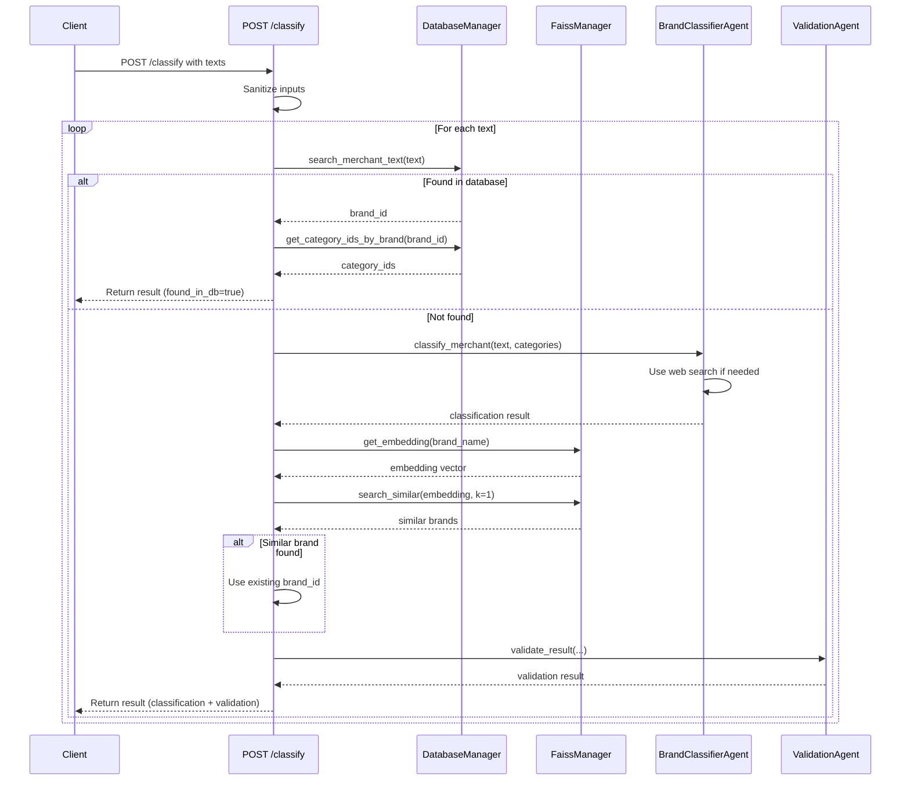
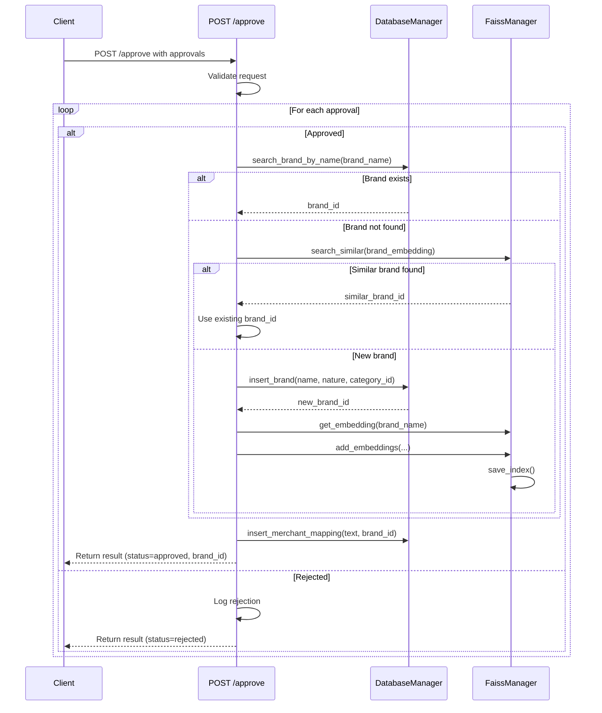
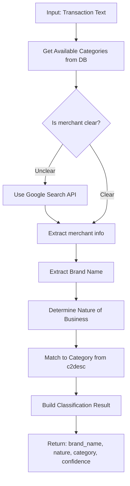
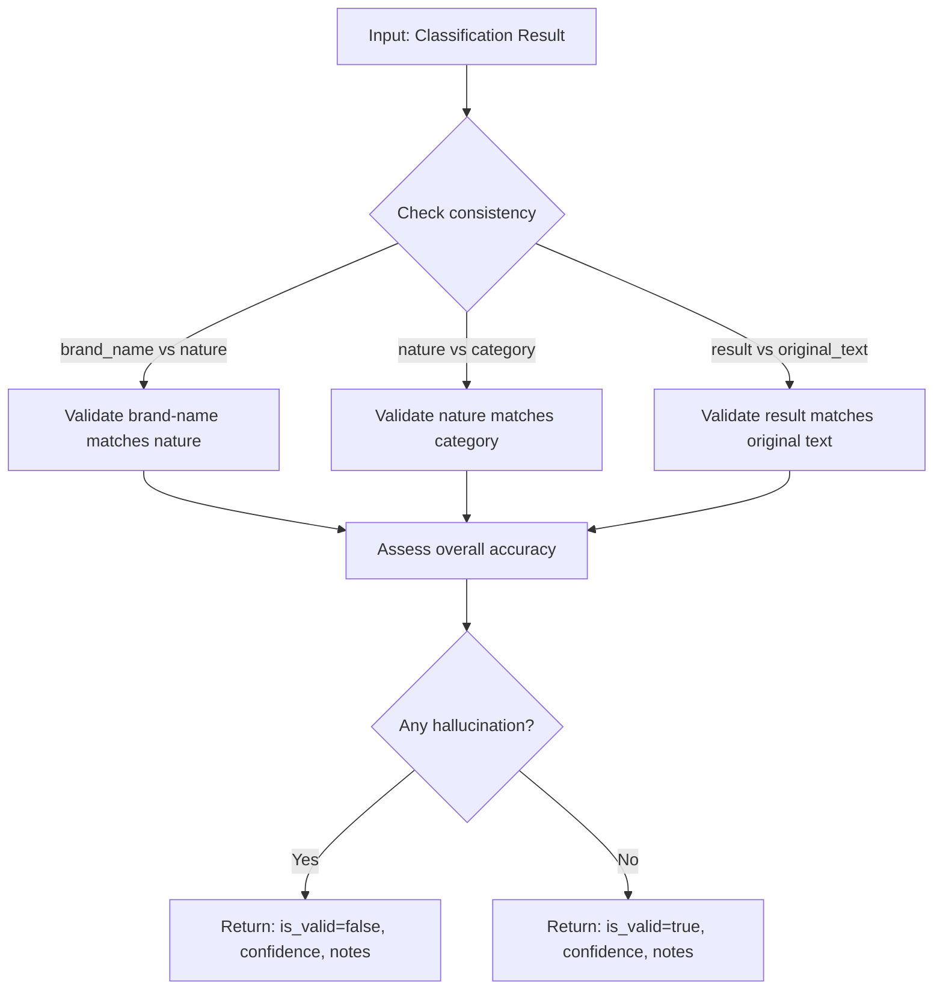

# FrankAsset Backend

Agentic AI backend for brand classification using Google ADK (Agent Development Kit). This system processes merchant/vendor text from transaction statements and classifies them into brands, nature of business, and spending categories using LLM agents.

## Overview

FrankAsset is a FastAPI-based backend that uses Google Cloud SDK and Python to:

- **Classify merchant text** from transaction statements into brands and categories
- **Use AI agents** (BrandClassifierAgent and ValidationAgent) powered by Google ADK
- **Store mappings** in SQLite database for fast lookups
- **Leverage FAISS** vector store for fuzzy brand matching
- **Provide RESTful APIs** for classification and approval workflows

### Key Features

- 🤖 **Two-stage AI agents**: BrandClassifierAgent for classification + ValidationAgent for hallucination prevention
- 🔍 **Intelligent search**: Google Search API integration for merchant information lookup
- 📊 **Efficient storage**: SQLite database + FAISS vector store for fast similarity search
- 🔄 **Approval workflow**: Human-in-the-loop approval system for quality control
- ⚙️ **Configurable**: Centralized configuration in `/config` folder for models and settings
- 📝 **Structured logging**: JSON-based logging using structlog
- 🧪 **Comprehensive tests**: Full test suite for all modules

## Project Structure

```
FrankAsset/
├── config/                      # Configuration files
│   ├── __init__.py
│   ├── models.yaml             # Model configurations (LLM, embeddings)
│   └── app.yaml                # Application settings (thresholds, limits)
├── data/                       # Data storage
│   ├── database.db             # SQLite database
│   └── faiss_index/            # FAISS vector store files
├── exception/                  # Exception handling
│   ├── __init__.py
│   └── custom_exception.py
├── logger/                     # Logging module
│   ├── __init__.py
│   └── custom_logger.py
├── src/                        # Main application modules
│   ├── __init__.py
│   ├── database/               # Database operations
│   │   ├── __init__.py
│   │   ├── db_manager.py       # SQLite database manager
│   │   └── models.py           # Pydantic models
│   ├── vector_store/           # FAISS vector store
│   │   ├── __init__.py
│   │   └── faiss_manager.py    # FAISS index management
│   ├── agents/                 # Google ADK agents
│   │   ├── __init__.py
│   │   ├── brand_classifier_agent.py  # 1st LLM Agent
│   │   └── validation_agent.py        # 2nd LLM Agent
│   └── api/                    # FastAPI routes
│       ├── __init__.py
│       ├── routes.py           # API route handlers
│       └── schemas.py          # Pydantic request/response models
├── utils/                      # Utility modules
│   ├── __init__.py
│   ├── config.py               # Configuration management
│   └── helpers.py              # Helper functions
├── test/                       # Test suite
│   ├── __init__.py
│   ├── test_database.py
│   ├── test_vector_store.py
│   ├── test_agents.py
│   └── test_api.py
├── main.py                     # FastAPI application entry point
├── pyproject.toml              # Dependencies
└── README.md                   # This file
```

### Module Descriptions

- **`config/`**: YAML configuration files for models and application settings
- **`data/`**: SQLite database and FAISS index storage
- **`src/database/`**: Database operations for m2b, b2c, and c2desc tables
- **`src/vector_store/`**: FAISS vector store for brand embedding similarity search
- **`src/agents/`**: Google ADK agents for classification and validation
- **`src/api/`**: FastAPI routes and schemas for REST endpoints
- **`utils/`**: Configuration loading and helper functions
- **`test/`**: Comprehensive test suite for all modules

## Architecture & Flow Diagrams

### Overall Architecture



### POST /classify Flow



### POST /approve Flow



### BrandClassifierAgent Flow



### ValidationAgent Flow



## Testing Instructions

### Prerequisites

- Python 3.11+
- All dependencies installed: `pip install -e .`
- (Optional) Google Cloud credentials configured for agent tests

### Running Tests

#### Run All Tests

```bash
pytest
```

#### Run Specific Test Modules

**Database Tests:**

```bash
pytest test/test_database.py -v
```

Tests database operations:
- Table creation
- Category insertion
- Brand insertion
- Merchant mapping insertion
- Search operations

**Vector Store Tests:**

```bash
pytest test/test_vector_store.py -v
```

Tests FAISS operations:
- Index initialization
- Adding embeddings
- Similarity search
- Save/load index

**Agent Tests:**

```bash
pytest test/test_agents.py -v
```

Tests LLM agents (requires Google ADK configuration):
- BrandClassifierAgent initialization
- Merchant classification
- ValidationAgent initialization
- Result validation

**API Tests:**

```bash
pytest test/test_api.py -v
```

Tests FastAPI endpoints:
- POST /classify endpoint
- POST /approve endpoint
- Health check endpoint
- Error handling

#### Run with Coverage

```bash
pytest --cov=src --cov=utils --cov-report=html
```

#### Run Individual Test Functions

```bash
pytest test/test_database.py::TestDatabaseManager::test_insert_brand -v
```

### Testing Workflow for New Users

1. **Start with Database Tests** (no external dependencies):
   ```bash
   pytest test/test_database.py -v
   ```
   This verifies database setup and CRUD operations.

2. **Test Vector Store** (requires FAISS, but not Vertex AI):
   ```bash
   pytest test/test_vector_store.py -v
   ```
   This tests FAISS index operations with dummy embeddings.

3. **Test API Endpoints** (requires database):
   ```bash
   pytest test/test_api.py -v
   ```
   This tests API integration with database.

4. **Test Agents** (requires Google Cloud credentials):
   ```bash
   pytest test/test_agents.py -v
   ```
   This tests LLM agent functionality (may be skipped if credentials not configured).

5. **Run Full Test Suite**:
   ```bash
   pytest -v
   ```

## Jupyter Notebooks

This project includes Jupyter notebooks in the `/notebooks` folder for interactive development and testing, including credential testing.

### Installing ipykernel

To use Jupyter notebooks with this project, you need to install `ipykernel`:

**Using pip:**
```bash
pip install ipykernel
```

**Using UV:**
```bash
uv pip install ipykernel
```

**Or install all development dependencies (includes ipykernel):**
```bash
pip install -r requirements-dev.txt
```

### Registering the Kernel

After installing `ipykernel`, register the project environment as a Jupyter kernel:

```bash
python -m ipykernel install --user --name=frankasset --display-name "Python (FrankAsset)"
```

This creates a kernel named `frankasset` that you can select in Jupyter Notebook, JupyterLab, or VS Code.

### Using the Notebooks

1. **Open the notebook** (`notebooks/test_credentials.ipynb`) in:
   - Jupyter Notebook: `jupyter notebook`
   - JupyterLab: `jupyter lab`
   - VS Code: Open the `.ipynb` file directly

2. **Select the kernel**: Choose "Python (FrankAsset)" from the kernel selector

3. **Run the cells**: The notebook includes functions to test credentials from your `.env` file

### Available Notebooks

- **`notebooks/test_credentials.ipynb`**: Test environment variables and credentials from `.env` file
  - Tests required and optional credentials
  - Validates configuration setup
  - Masks sensitive values for safe display

## Configuration Folder

The `/config` folder contains centralized configuration files for models and application settings.

### Purpose

The config folder separates configuration from code, making it easy to:
- Switch between different LLM models
- Adjust similarity thresholds and limits
- Modify application settings without code changes
- Maintain different configurations for different environments

### Configuration Precedence

Configuration values are loaded in the following order (higher priority overrides lower):

1. **Environment Variables** (highest priority)
2. **YAML Config Files** (`config/models.yaml`, `config/app.yaml`)
3. **Code Defaults** (lowest priority)

### models.yaml

Defines available LLM and embedding models:

```yaml
llm_models:
  default: "gemini-1.5-pro"
  available:
    - name: "gemini-1.5-pro"
      provider: "google-vertex-ai"
      description: "Default LLM for agents"
    
embedding_models:
  default: "textembedding-gecko@003"
  available:
    - name: "textembedding-gecko@003"
      provider: "google-vertex-ai"
      dimension: 768

agent_assignments:
  brand_classifier:
    model: "gemini-1.5-pro"
  validation:
    model: "gemini-1.5-pro"
```

**Usage:** Modify `agent_assignments` to use different models for each agent.

### app.yaml

Defines application settings:

```yaml
faiss:
  similarity_threshold: 0.3  # Lower = more similar required
  default_k: 5
  dimension: 768

api:
  max_texts_per_request: 100
  timeout_seconds: 30

agents:
  max_retries: 3
  confidence_threshold: 0.6
```

**Usage:** Adjust thresholds, limits, and timeouts based on your requirements.

### How to Modify Configurations

1. **Edit YAML files** in `config/` folder:
   ```bash
   # Edit model configurations
   nano config/models.yaml
   
   # Edit application settings
   nano config/app.yaml
   ```

2. **Or use environment variables** (takes precedence):
   ```bash
   export LLM_MODEL="gemini-1.5-flash"
   export EMBEDDING_MODEL="textembedding-gecko@002"
   ```

3. **Restart the application** to load new configurations.

## Setup and Installation

### Requirements

- Python 3.11 or higher
- Google Cloud Project with Vertex AI enabled
- Google Search API key and Custom Search Engine ID

### Environment Variables

Create a `.env` file or set the following environment variables:

```bash
# Google Cloud Configuration
GOOGLE_CLOUD_PROJECT=your-project-id
GOOGLE_CLOUD_LOCATION=us-central1

# Google Search API
GOOGLE_SEARCH_API_KEY=your-api-key
GOOGLE_SEARCH_ENGINE_ID=your-engine-id

# Optional: Override defaults
LLM_MODEL=gemini-1.5-pro
EMBEDDING_MODEL=textembedding-gecko@003
DB_PATH=data/database.db
LOG_DIR=logs
```

### Installation Steps

#### Using UV (Recommended)

UV is a fast Python package manager that's 10-100× faster than pip. It's the recommended installation method.

1. **Install UV:**
   ```bash
   # macOS and Linux
   curl -LsSf https://astral.sh/uv/install.sh | sh
   
   # Windows
   powershell -ExecutionPolicy ByPass -c "irm https://astral.sh/uv/install.ps1 | iex"
   
   # Or via pip
   pip install uv
   ```

2. **Clone the repository** (if applicable)

3. **Create virtual environment with UV:**
   ```bash
   uv venv
   ```

4. **Activate virtual environment:**
   ```bash
   # Linux/Mac
   source .venv/bin/activate
   
   # Windows
   .venv\Scripts\activate
   ```

5. **Install dependencies:**
   ```bash
   # Install from pyproject.toml (recommended)
   uv pip install -e .
   
   # Or install from requirements.txt
   uv pip install -r requirements.txt
   
   # Or use uv sync (if using uv.lock file)
   # uv sync
   ```

6. **Set up Google Cloud credentials:**
   ```bash
   gcloud auth application-default login
   ```

7. **Configure environment variables** (see above)

8. **Initialize database and categories:**
   ```python
   # Database will be created automatically on first run
   # Add initial categories if needed
   ```

9. **Run the application:**
   ```bash
   # Using uv run (recommended)
   uv run python main.py
   
   # Or using uvicorn directly with uv
   uv run uvicorn main:app --reload
   
   # Or using python directly (if venv is activated)
   python main.py
   ```

10. **Access API documentation:**
    - Swagger UI: http://localhost:8000/docs
    - ReDoc: http://localhost:8000/redoc

#### Using Pip (Alternative)

For backward compatibility, you can also use pip and venv:

1. **Clone the repository** (if applicable)

2. **Create virtual environment:**
   ```bash
   python -m venv venv
   source venv/bin/activate  # On Windows: venv\Scripts\activate
   ```

3. **Install dependencies:**
   ```bash
   # Install from pyproject.toml
   pip install -e .
   
   # Or install from requirements.txt
   pip install -r requirements.txt
   ```

4. **Set up Google Cloud credentials:**
   ```bash
   gcloud auth application-default login
   ```

5. **Configure environment variables** (see above)

6. **Run the application:**
   ```bash
   python main.py
   ```

7. **Access API documentation:**
    - Swagger UI: http://localhost:8000/docs
    - ReDoc: http://localhost:8000/redoc

### Running the Uvicorn Server

The application uses uvicorn as the ASGI server. There are several ways to run it:

#### Using `python main.py` (Default)

This is the simplest method and uses the configuration in `main.py`:

```bash
python main.py
```

This runs with:
- Host: `0.0.0.0`
- Port: `8000`
- Auto-reload: `True` (development mode)
- Log level: `info`

#### Using `uvicorn` directly

You can run uvicorn directly for more control:

```bash
# Basic usage
uvicorn main:app --reload

# Specify host and port
uvicorn main:app --host 0.0.0.0 --port 8000 --reload

# Production mode (no reload)
uvicorn main:app --host 0.0.0.0 --port 8000

# Custom log level
uvicorn main:app --log-level debug --reload
```

#### Using `uv run uvicorn` (Recommended with UV)

When using UV, you can use `uv run` to automatically use the virtual environment:

```bash
# With auto-reload (development)
uv run uvicorn main:app --reload

# Production mode
uv run uvicorn main:app --host 0.0.0.0 --port 8000

# With custom configuration
uv run uvicorn main:app --host 0.0.0.0 --port 8000 --log-level info
```

#### Uvicorn Command-Line Options

Common uvicorn options:

- `--reload` - Enable auto-reload on code changes (development only)
- `--host` - Bind to specific host (default: `127.0.0.1`)
- `--port` - Bind to specific port (default: `8000`)
- `--log-level` - Set log level (`critical`, `error`, `warning`, `info`, `debug`, `trace`)
- `--workers` - Number of worker processes (production only)
- `--ssl-keyfile` - SSL key file (HTTPS)
- `--ssl-certfile` - SSL certificate file (HTTPS)

Example production command:

```bash
uvicorn main:app --host 0.0.0.0 --port 8000 --workers 4
```

## API Documentation

### Base URL

```
http://localhost:8000/api/v1
```

### Endpoints

#### POST /classify

Classify one or more merchant texts.

**Request:**
```json
{
  "texts": "Shopping at AMAZON"
}
```
or
```json
{
  "texts": ["Shopping at AMAZON", "Payment to MCDONALDS"]
}
```

**Response:**
```json
{
  "results": [
    {
      "text": "Shopping at AMAZON",
      "found_in_db": false,
      "brand_id": null,
      "category_ids": [],
      "classification": {
        "brand_name": "AMAZON",
        "nature_of_business": "E-commerce",
        "category_description": "Online Marketplace",
        "category_id": 4,
        "confidence": 0.95,
        "validation": {
          "is_valid": true,
          "confidence": 0.90,
          "notes": "Classification is consistent and accurate"
        }
      }
    }
  ]
}
```

#### POST /approve

Handle approval/rejection of classifications.

**Request:**
```json
{
  "approvals": [
    {
      "text": "Shopping at AMAZON",
      "approved": true,
      "brand_name": "AMAZON",
      "category_id": 4,
      "nature_of_business": "E-commerce"
    }
  ]
}
```

**Response:**
```json
{
  "results": [
    {
      "text": "Shopping at AMAZON",
      "status": "approved",
      "brand_id": 1,
      "message": "Classification approved and persisted"
    }
  ]
}
```

#### GET /health

Health check endpoint.

**Response:**
```json
{
  "status": "healthy",
  "database": "connected",
  "message": "All systems operational"
}
```

## Future Work

### Planned Enhancements

1. **Multi-language Support**
   - Support for multiple languages in merchant text classification
   - Multilingual embedding models

2. **Caching Layer**
   - Redis cache for frequently accessed classifications
   - Cache invalidation strategies

3. **Batch Processing**
   - Asynchronous batch processing for large volumes
   - Background job queue (Celery/RQ)

4. **Advanced Analytics**
   - Classification accuracy metrics
   - Agent performance tracking
   - Category distribution analytics

5. **Webhook Support**
   - Webhooks for approval notifications
   - Event-driven architecture

### Potential Improvements

1. **Model Fine-tuning**
   - Fine-tune LLM models on domain-specific data
   - Custom category classification models

2. **Enhanced FAISS Search**
   - Hierarchical navigable small world (HNSW) index for better performance
   - GPU acceleration for large-scale similarity search

3. **Database Optimization**
   - Connection pooling for SQLite
   - Read replicas for high-traffic scenarios

4. **Security Enhancements**
   - API rate limiting per client
   - Authentication and authorization
   - Input validation and sanitization improvements

5. **Monitoring & Observability**
   - Prometheus metrics integration
   - Distributed tracing with OpenTelemetry
   - Performance monitoring dashboard

### Extension Opportunities

1. **Additional Data Sources**
   - Integration with payment processors
   - Real-time transaction feeds
   - Bank statement parsing

2. **Machine Learning Pipeline**
   - Continuous learning from approvals
   - Model retraining pipeline
   - A/B testing framework for models

3. **Admin Dashboard**
   - Web UI for managing categories and brands
   - Approval workflow management
   - Configuration management interface

4. **API Extensions**
   - GraphQL API support
   - WebSocket for real-time updates
   - RESTful bulk operations

5. **Deployment Enhancements**
   - Docker containerization
   - Kubernetes deployment manifests
   - CI/CD pipeline integration

## License

[Add your license here]

## Contributing

[Add contribution guidelines here]
